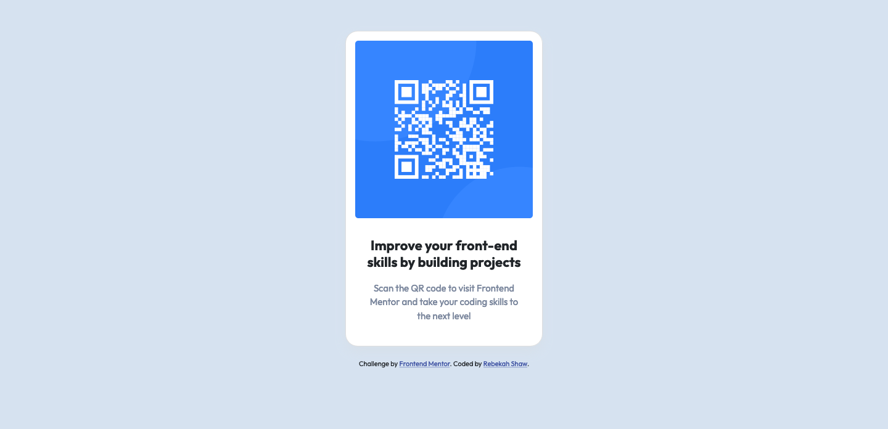
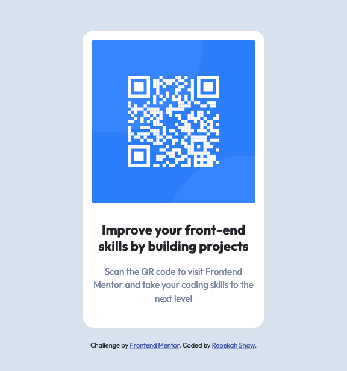

# Frontend Mentor - QR code component

This is a solution to the [QR code component challenge on Frontend Mentor](https://www.frontendmentor.io/challenges/qr-code-component-iux_sIO_H). Frontend Mentor challenges help you improve your coding skills by building realistic projects. 

## Table of contents

- [Overview](#overview)
  - [Screenshot](#screenshot)
  - [Links](#links)
- [My process](#my-process)
  - [Built with](#built-with)
  - [What I learned](#what-i-learned)
  - [Continued development](#continued-development)
  - [Useful resources](#useful-resources)
- [Author](#author)

## Overview

### Screenshot

#### Desktop

#### Mobile 

### links

- Solution URL: [ Solution](https://github.com/rebekahshaw92/qr-code-component)
- Live Site URL: [Live Site](https://rebekahshaw92.github.io/qr-code-component)

## My Process

### Built with

- Semantic HTML5 markup
- CSS custom properties
- Sass
- Bootstrap 5
- Mobile-first workflow

### What I Learned

Through doing this project I learned more about bootstrap cards and how to style them for different devices.

### Continued Development

I will continue to work with bootstrap and learn more about what I can do with it.

### Useful Resources

- [Bootstrap]https://getbootstrap.com) - This site helped me learn all I needed to know about Bootstrap.

## Author

- Website - [Rebekah Shaw](https://www.rebekahshaw.com)
- Frontend Mentor - [@rebekahshaw92](https://www.frontendmentor.io/profile/rebekahshaw92)
- Twitter - [@x_beckyboo_x](https://www.twitter.com/x_beckyboo_x)